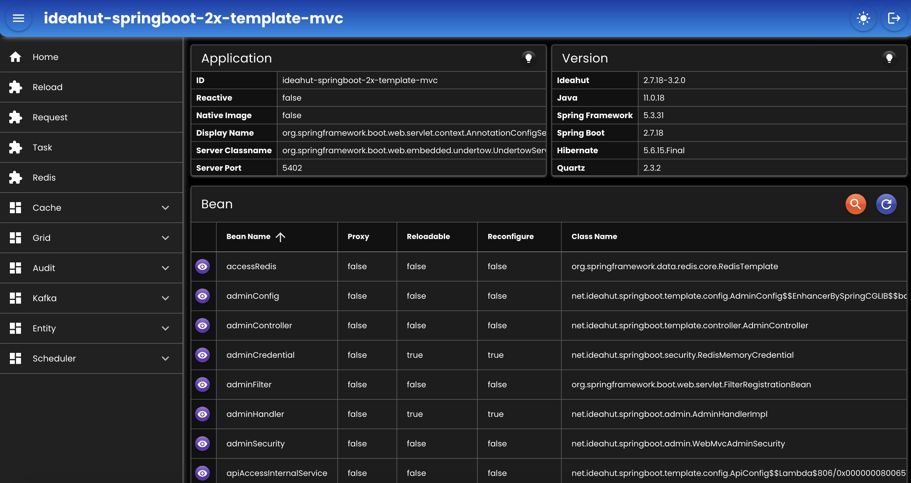

# Spring Boot 2x Template (WebMvc)  

- Template implementasi dari Ideahut Springboot 2x Library (WebMvc).
- Dokumentasi dapat dilihat di [Ideahut Springboot](https://github.com/ideahut-apps-team/ideahut-springboot-docs/)

## Admin
- `URL`  : http://localhost:5402/_/web
- `User` : admin
- `Pass` : password

   

##

### [Index](https://github.com/thomson470/Ideahut-Template)
